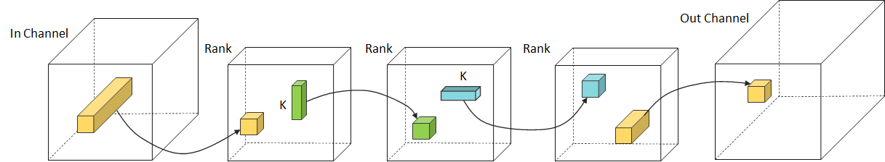

# Compression Method

## Structured Pruning

### Pruning by Criteria

Difference of each pruning method is about measuring importance of filters in each layer. Filters in each layer will be automatically pruned based on certain criteria.

#### Structured Neuron-level Pruning (SNP)

- SNP prunes graphically connected query and key layers having the least informative attention scores while preserving the overall attention scores. Value layers, which can be pruned independently, are pruned to eliminate inter-head redundancy.
- Click the link for more information. ([Structured Neuron-level Pruning](https://arxiv.org/abs/2404.11630))

#### L2 Norm Pruning

- L2-Norm is used to represent the importance of the corresponding filter. In other words, this method prunes filters based on the magnitude of weights.
- Click the link for more information. ([L2 Norm Pruning](https://docs.netspresso.ai/docs/mc-structured-pruning#supported-functions))

#### GM Pruning

- Geometric Median is used to measure the redundancy of the corresponding filter and remove redundant filters.
- Click the link for more information. ([GM Pruning](https://docs.netspresso.ai/docs/mc-structured-pruning#supported-functions))

#### Nuclear Norm Pruning

- The Nuclear Norm is the sum of the singular values representing the energy. It computes the nuclear norm on the feature map to determine the filter's relevance. For this reason, a portion of the dataset is needed.
- Click the link for more information. ([Nuclear Norm Pruning](https://docs.netspresso.ai/docs/mc-structured-pruning#supported-functions))

### Pruning by Channel Index

- This function prunes the chosen filters of each layer through the index without certain criteria.
- You can apply your own criteria to prune the model.
- If the selected filters are redundant or less important, it will return a better performing model.
- Click the link for more information. ([Pruning By Index](https://docs.netspresso.ai/docs/mc-structured-pruning#supported-functions))

---

## Filter Decomposition

### Tucker Decomposition

- Approximating the original filters by Tucker decomposition method.
- This method decomposes the convolution with a 4D kernel tensor into two factor matrices and one small core tensor.
- Click the link for more information. ([Tucker Decomposition](https://docs.netspresso.ai/docs/mc-filter-decomposition#supported-method))

### Singular Value Decomposition

- Approximating the original filters by Singular value decomposition method.
- This method decomposes the pointwise convolution or fully-connected layer into two pointwise or fully-connected layers.
- Click the link for more information. ([Singular Value Decomposition](https://docs.netspresso.ai/docs/mc-filter-decomposition#supported-method))

### CP Decomposition

- Approximating the original filters by CP decomposition method.
- This method approximates the convolution with a 4D kernel tensor by the sequence of four convolutions with small 2D kernel tensors.
- Click the link for more information. ([CP Decomposition](https://docs.netspresso.ai/docs/mc-filter-decomposition#supported-method))

