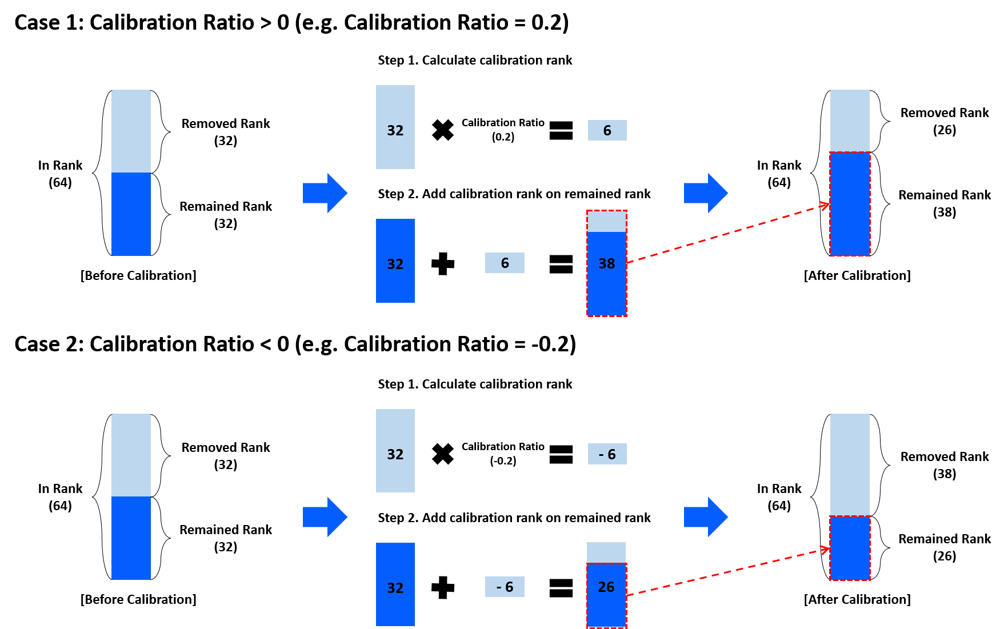

# Compressor(Recommendation Compression)

## Description

::: netspresso.compressor.v2.compressor.CompressorV2.recommendation_compression
    handler: python
    options:
      members:
        - automatic_quantization
      heading_level: 3
      show_root_heading: true
      show_source: false
      show_symbol_type_toc: true

### Details of Parameters

#### Compression Method

##### Available Compression Method

| Name   | Description                      |
|--------|----------------------------------|
| PR_L2  | L2 Norm Pruning                  |
| PR_GM  | GM Pruning                       |
| PR_NN  | Nuclear Norm Pruning             |
| PR_SNP | Structured Neuron-level Pruning  |
| FD_TK  | Tucker Decomposition             |
| FD_SVD | Singular Value Decomposition     |

##### Example

```python
from netspresso.enums import CompressionMethod

COMPRESSION_METHOD = CompressionMethod.PR_L2
```

!!! warning
    - Nuclear Norm is only supported in the Tensorflow-Keras framework.
    - Structured Neuron-level is only supported in the PyTorch and ONNX frameworks.

!!! note
    - Click on the link to learn more about the information. ([Compression Method](compression_method.md))

#### Recommendation Method

##### Available Recommendation Method

| Name  | Description                                                         |
|-------|---------------------------------------------------------------------|
| SLAMP | Structured Layer-adaptive Sparsity for the Magnitude-based Pruning |
| VBMF  | Variational Bayesian Matrix Factorization                           |

##### Example

```python
from netspresso.enums import RecommendationMethod

RECOMMENDATION_METHOD = RecommendationMethod.SLAMP
```

!!! note
    - If you selected **PR_L2**, **PR_GM**, **PR_NN**, **PR_SNP** for compression_method
        - The recommended_method available is **SLAMP**.
    - If you selected **FD_TK**, **FD_SVD** for compression_method
        - The recommended_method available is **VBMF**.

#### Recommendation Ratio

- **SLAMP (Pruning ratio)**
    - Remove corresponding amounts of the filters. (e.g. 0.2 removes 20% of the filters in each layer)
    - Available ranges: `0 < ratio < 1`
    
    - Click the link for more information. ([SLAMP](https://docs.netspresso.ai/docs/mc-structured-pruning#supported-functions))

- **VBMF (Calibration ratio)**
    - This function control compression level of model if the result of recommendation doesn't meet the compression level user wants. Remained rank add or subtract (removed rank x calibration ratio) according to calibration ratio range.
    <div align="center">
        
    </div>
    - Available ranges: `-1 ≤ ratio ≤ 1`
    
    - Click the link for more information. ([VBMF](https://docs.netspresso.ai/docs/mc-filter-decomposition#recommendation-in-model-compressor))

#### Options

##### Example

```python
from netspresso.enums import Policy, LayerNorm, GroupPolicy
from netspresso.clients.compressor.v2.schemas import Options

OPTIONS = Options(
    policy=Policy.AVERAGE,
    layer_norm=LayerNorm.TSS_NORM,
    group_policy=GroupPolicy.COUNT,
    reshape_channel_axis=-1
)
```

!!! note
    - Click the link for more information. ([Pruning Options](pruning_options.md))

!!! warning
    - Nuclear Norm is only supported in the Tensorflow-Keras framework.
    - Structured Neuron-level is only supported in the PyTorch and ONNX frameworks.


## Example

```python
from netspresso import NetsPresso
from netspresso.enums import CompressionMethod, RecommendationMethod


netspresso = NetsPresso(email="YOUR_EMAIL", password="YOUR_PASSWORD")

compressor = netspresso.compressor_v2()
compressed_model = compressor.recommendation_compression(
    compression_method=CompressionMethod.PR_L2,
    recommendation_method=RecommendationMethod.SLAMP,
    recommendation_ratio=0.5,
    input_model_path="./examples/sample_models/graphmodule.pt",
    output_dir="./outputs/compressed/graphmodule_recommend",
    input_shapes=[{"batch": 1, "channel": 3, "dimension": [224, 224]}],
)
```
