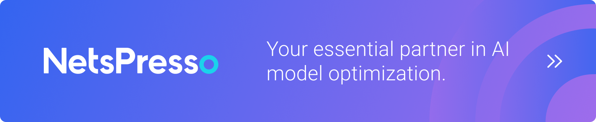

# Welcome to NetsPresso!

   

      
   

   

      <a href="https://www.python.org/downloads/" target="_blank">
      
      
      
   
    

  🤝 Collaboration with partners 🤝  

  

  <a href="https://github.com/STMicroelectronics/stm32ai-modelzoo"> STM32 x NetsPresso</a>

 

  ☀️ NetsPresso Model Zoo ☀️  
      <a href="https://github.com/Nota-NetsPresso/ModelZoo-YOLOFastest-for-ARM-U55-M85"> YOLO Fastest </a>
    | <a href="https://github.com/Nota-NetsPresso/yolox_nota"> YOLOX </a>
    | <a href="https://github.com/Nota-NetsPresso/ultralytics_nota"> YOLOv8 </a> 
    | <a href="https://github.com/Nota-NetsPresso/ModelZoo-YOLOv7"> YOLOv7 </a> 
    | <a href="https://github.com/Nota-NetsPresso/yolov5_nota"> YOLOv5 </a> 
    | <a href="https://github.com/Nota-NetsPresso/PIDNet_nota"> PIDNet </a>     
    | <a href="https://github.com/Nota-NetsPresso/pytorch-cifar-models_nota"> PyTorch-CIFAR-Models</a>

 

  🔥 NetsPresso Model Optimization Tutorials 🔥  
     
     

 

Learn how to install and use the NetsPresso.

> **Note**
> 
> You need an account to use the **NetsPresso**.
> 
> 👉🏻 Please create an account at [NetsPresso](https://portal.netspresso.ai/signup?redirection_link=https://netspresso.ai/get_started/%23notice&utm_source=py_docs&utm_medium=page&utm_campaign=np_renew)

## Table of Contents

- [Installation](installation.md)
- [Description](description.md)

## Contact

Join our [Discussion Forum](https://github.com/orgs/Nota-NetsPresso/discussions) for providing feedback or sharing your use cases, and if you want to talk more with Nota, please contact us here.
Or you can also do it via email([netspresso@nota.ai](mailto:netspresso@nota.ai)) or phone(+82 2-555-8659)!